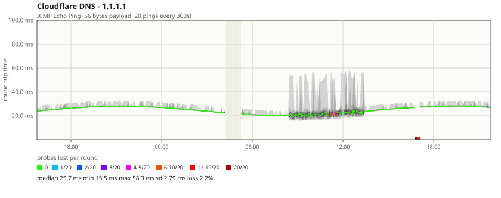

# SmokePing.NET

A native Windows reimplementation of [SmokePing](https://oss.oetiker.ch/smokeping/)
in C# / .NET 8. It measures network latency and packet loss, stores the results in a
fixed-size round-robin database, and serves the familiar "smoke" graphs from a
built-in web server.



*A graph as served over HTTP. The desktop client draws the same picture natively.*

## Why

SmokePing itself is Perl and depends on RRDtool, fping and a CGI-capable web server.
On Windows that means WSL, Cygwin or a container — none of which are pleasant to run
as a long-lived service on a Windows box. This is a from-scratch implementation of
the same ideas with none of that baggage:

* one self-contained executable, no Perl, no RRDtool, no fping, no web server;
* **no NuGet dependencies** — everything runs on the .NET shared framework;
* ICMP works without administrator rights on Windows (it uses the IP Helper API);
* installs as a proper Windows service;
* a native WinForms desktop client, as well as the web interface.

The data model, the graph design, the loss colour scale and the alert pattern
language all follow upstream, so graphs and alert rules are directly comparable with
an existing SmokePing installation. See [docs/COMPATIBILITY.md](docs/COMPATIBILITY.md)
for exactly what matches and what does not.

## Quick start

```powershell
git clone <this repository>
cd smokeping-windows

# Check the sample configuration, then edit it for your network
dotnet run --project src/SmokePing.Net -- --config config/smokeping.json --check

dotnet run --project src/SmokePing.Net -- --config config/smokeping.json
```

Then open <http://localhost:8081>.

The first graphs appear after one polling interval (five minutes by default) and get
more interesting over the following hours.

### The desktop client

There are two interfaces, and they draw the same graphs from the same layout code:

```powershell
# Connect to a daemon that is already running (locally or on another machine)
dotnet run --project src/SmokePing.Net.Desktop -- --server http://localhost:8081

# Or run the daemon inside the desktop process, so one executable does everything
dotnet run --project src/SmokePing.Net.Desktop -- --standalone config/smokeping.json
```

The client is a viewer: it reads through the daemon's HTTP API rather than opening
the measurement files, because the daemon owns those and two processes writing the
same round-robin file would corrupt it. That is also what lets it watch a daemon
running on another machine.

Graphs are drawn with GDI+ from the same `GraphScene` the web interface renders to
SVG, so the two views cannot drift apart — only the drawing backend differs.

### Install as a Windows service

From an elevated PowerShell prompt:

```powershell
.\scripts\Install-SmokePingService.ps1
```

This publishes to `C:\Program Files\SmokePing.NET`, registers the `SmokePingNet`
service, sets it to start automatically and to restart if it fails. Logs go to
`logs\smokeping.log` next to the configuration file. Remove it again with
`.\scripts\Uninstall-SmokePingService.ps1`.

## How it reads

Each row of the graph is one **measurement round**: by default twenty ICMP echoes,
half a second apart, every five minutes.

* the **line** is the median round-trip time of the round;
* the **grey smoke** around it is the spread of the individual probes — nested bands
  from the full min-max range on the outside to the tightest pair around the median.
  A thin line means a stable connection; a thick cloud means jitter;
* the **colour of the line** is packet loss: green for a clean round, through blue
  and purple, to dark red when nothing came back at all.

That combination is the whole point of SmokePing: latency, jitter and loss in one
picture, at a glance.

## Configuration

Everything lives in one JSON file. See [config/smokeping.json](config/smokeping.json)
for a worked example and [docs/CONFIGURATION.md](docs/CONFIGURATION.md) for the full
reference.

```jsonc
{
  "general": {
    "siteName": "SmokePing.NET",
    "dataDirectory": "../data",
    "listenUrl": "http://localhost:8081"
  },

  // Inherited by every target unless overridden further down the tree.
  "defaults": {
    "probe": "icmp",
    "step": 300,
    "pings": 20,
    "alertRules": ["someloss"]
  },

  "alerts": [
    {
      "name": "someloss",
      "type": "loss",
      "pattern": ">0%,*12*,>0%,*12*,>0%",
      "comment": "loss 3 times in a row"
    }
  ],

  "targets": [
    {
      "id": "internet",
      "title": "Internet",
      "children": [
        { "id": "cloudflare", "title": "Cloudflare DNS", "host": "1.1.1.1" },
        { "id": "google",     "title": "Google DNS",     "host": "8.8.8.8" }
      ]
    }
  ]
}
```

Targets form a tree. A node with a `host` is measured; a node without one is just a
menu folder. Settings are inherited down the tree, so `step`, `pings` or a probe type
can be set once on a folder and apply to everything below it.

### Probes

| Probe  | Measures                              | Extra settings   |
| ------ | ------------------------------------- | ---------------- |
| `icmp` | ICMP echo round-trip time (default)   | `packetSize`     |
| `tcp`  | Time to complete a TCP handshake      | `port`           |
| `dns`  | Time for a DNS server to answer       | `port`, `query`  |
| `http` | Time to fetch a URL, body included    | `url`            |

`tcp` is the one to reach for when ICMP is filtered, and it measures what users
actually wait for. `dns` builds and parses the query itself, so it measures the named
server rather than whatever the system resolver has cached.

### Alerts

Alert rules use SmokePing's detector pattern language: a comma-separated list of
comparisons matched against the most recent rounds, anchored at the newest one.

```jsonc
{ "type": "loss", "pattern": "==100%,==100%,==100%" }   // dead for three rounds
{ "type": "loss", "pattern": ">0%,*12*,>0%,*12*,>0%" }  // three lossy rounds, gaps allowed
{ "type": "rtt",  "pattern": "<10,<10,<10,<100,>100" }  // latency stepped up
{ "type": "rtt",  "pattern": ">100<200" }               // newest round inside a range
```

`loss` patterns are in percent, `rtt` patterns in milliseconds. `*N*` matches up to N
arbitrary rounds, `==U` matches a round with no data, `==S` matches the start marker
before a target has ever been measured, and `==*` matches any single round.

When a rule matches, SmokePing.NET logs it, and can POST it to a `webhookUrl` and/or
run a `command`. Edge-triggered rules (the default) notify on the transition into and
out of the alert state; set `"edgeTrigger": false` to be told every round instead.

## Storage

Each target gets one fixed-size `.spd` file that never grows. It holds the same
resolution tiers upstream's RRD files do:

| Resolution     | Retention |
| -------------- | --------- |
| 5 minutes      | 100 days  |
| 1 hour         | 400 days  |
| 12 hours       | 3.9 years |

Rather than storing each individual ping, every round is reduced to eleven quantiles
(0%, 10% … 100%) plus the sent and lost counts. That is enough to redraw the smoke
exactly, keeps every record the same 60 bytes, and subsumes the separate MIN/MAX/AVERAGE
archives RRDtool needs — about 2.4 MB per target, forever.

Coarse tiers are recomputed from the full-resolution tier on every write, so a missed
poll or an unclean shutdown can never leave a bucket permanently wrong.

## HTTP API

The web interface is a thin client over a small JSON API. The graph endpoint returns
plain SVG, so it can be dropped straight into a dashboard, a wiki or an e-mail.

| Endpoint | Purpose |
| -------- | ------- |
| `GET /api/config` | Site name and the menu tree |
| `GET /api/targets` | Every measured target |
| `GET /api/targets/{id}?range=3h` | Samples and statistics for one target |
| `GET /api/graph/{id}.svg?range=3h` | A rendered graph |
| `GET /api/charts?range=10h` | Top-N by std deviation, max, loss and median |
| `GET /api/alerts` | Rules, active alerts and recent notifications |
| `GET /api/health` | Liveness and target count |

Graph parameters: `range` (`90m`, `3h`, `10d`, `2w`, `6mon`, `1y`), `width`, `height`,
`theme` (`light` or `dark`), `compact`, and `offsetMinutes` to label the time axis in
a local time zone.

```
http://localhost:8081/api/graph/internet/cloudflare.svg?range=30h&theme=dark&width=900
```

## Command line

```
--config <path>     Configuration file (default: config/smokeping.json)
--check             Validate the configuration and exit
--service           Run under the Windows service control manager
--service-name      Service name to register as (default: SmokePingNet)
--log-file <path>   Write a log file (always on in service mode)
--no-polling        Serve the web interface without taking measurements
--help              Show this help
```

`--check` validates everything up front — pattern syntax, unknown probes, duplicate
ids, alert names that do not exist, and rounds too long to fit in their step — so a
typo is caught at start-up rather than silently leaving a host unmonitored.

## Project layout

| Project | What it is |
| --- | --- |
| `src/SmokePing.Net` | The daemon: probes, storage, alerting, web interface. Runs anywhere .NET 8 does |
| `src/SmokePing.Net.Desktop` | The native WinForms client. Windows only |
| `tests/SmokePing.Net.Tests` | The test suite |

Graph layout lives in `SmokeGraphLayout`, which produces a backend-independent scene.
`SvgSceneWriter` turns that into SVG for the web interface and the HTTP API;
`GdiSceneRenderer` draws the same scene with GDI+ in the desktop client. Adding a
primitive to the layout is a compile-or-throw error in both backends, so neither view
can quietly lose part of the picture.

## Building and testing

```bash
dotnet build SmokePing.Net.sln
dotnet run --project tests/SmokePing.Net.Tests          # run every test
dotnet run --project tests/SmokePing.Net.Tests -- alert # run a subset
```

The tests are a self-contained runner rather than xunit, for the same reason the
daemon has no NuGet dependencies: the daemon and its tests build on a machine with
nothing installed but the .NET SDK.

Building the desktop client on Windows needs nothing extra. Cross-building it from
Linux or macOS works too — `EnableWindowsTargeting` is set — but that route restores
the Windows Desktop targeting pack from NuGet, so it needs network access. To skip it
entirely, build the two platform-independent projects instead of the solution:

```bash
dotnet build src/SmokePing.Net tests/SmokePing.Net.Tests
```

## Licence

GPL-2.0-or-later, matching upstream SmokePing, whose data model and graph design this
implementation deliberately follows. SmokePing is copyright Tobias Oetiker; this is an
independent reimplementation in C# and shares none of its code.
